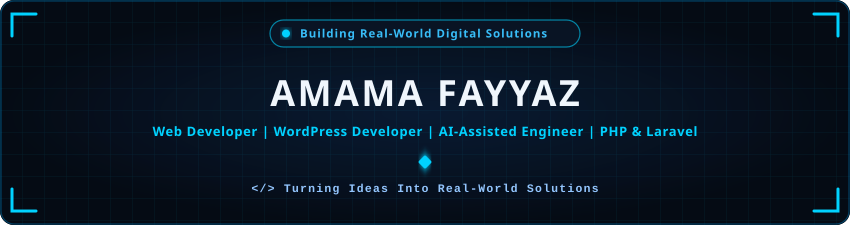
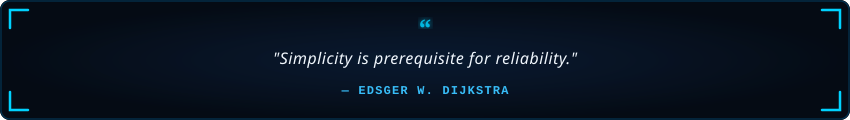

<!-- Header Banner -->

  

<!-- Typing SVG (Visual Only - No Dead Links) -->

  

<!-- Social Quick Links (Only Real Working Links) -->

  
  &nbsp;
  

---

<h2 align="center">🔹 About Me</h2>

  

  

  Hey! I'm <b>Amama Fayyaz</b>, a passionate <b>Web Developer &amp; AI-Assisted Engineer</b> based in Pakistan. 🇵🇰 
  I specialize in architecting scalable backend systems with <b>PHP &amp; Laravel</b>, engineering dynamic sites with <b>WordPress &amp; Elementor</b>, and integrating <b>AI-assisted workflows</b> to build real-world digital solutions.

  
  &nbsp;
  
  &nbsp;
  

  💬 <b>Let's Discuss:</b> PHP, Laravel, WordPress, MySQL, REST APIs, JavaScript &amp; Prompt Engineering. 
  ⚡ <b>Philosophy:</b> <i>"Turning complex ideas into clean, functional, and production-ready digital solutions!"</i>

<table width="100%" border="0" align="center">
<tr>
<td width="50%" align="center" style="padding: 14px;">
  <h4>🔭 Flagship Application</h4>
  
<b>Gradora App</b> AI Study Planner, Timetable Generator &amp; Weakness Tracker

</td>
<td width="50%" align="center" style="padding: 14px;">
  <h4>🌱 Active Deep Dives</h4>
  
<b>Laravel Ecosystem &amp; System Architecture</b> Distributed Databases &amp; Secure APIs

</td>
</tr>
<tr>
<td width="50%" align="center" style="padding: 14px;">
  <h4>💼 Commercial Venture</h4>
  
<b>Spendaura</b> Founder &amp; Platform Developer (Acquired)

</td>
<td width="50%" align="center" style="padding: 14px;">
  <h4>🤝 Collaboration</h4>
  
<b>Web, Backend &amp; Custom CMS</b> Open to remote roles &amp; freelance projects

</td>
</tr>
</table>

---

<h2 align="center">🔹 Featured Venture Spotlight</h2>

<table width="100%" border="0" align="center">
<tr>
<td align="center" style="padding: 24px; background: #060c16; border: 1.2px solid #00d2ff55; border-radius: 12px;">
  <h3 style="color: #00d2ff; margin-bottom: 6px;">💼 Spendaura — Commercial E-Commerce Venture</h3>
  
<b>Founder &amp; Lead Platform Developer &nbsp;|&nbsp; Status: Successfully Acquired / Sold</b>

  

    <i>An end-to-end commercial startup independently conceptualized, engineered, and managed from zero to operational maturity. Built the comprehensive digital infrastructure, custom WordPress &amp; Elementor storefront, inventory workflows, and responsive UI/UX. Following market traction and successful regional operations, the platform and business assets were officially acquired by a local vendor.</i>
  

   
  

    
    &nbsp;
    
    &nbsp;
    
  

</td>
</tr>
</table>

---

<h2 align="center">🚀 Core Engineering &amp; Production Builds</h2>

<table width="100%" border="0" align="center">
<tr>
<td width="50%" align="center" style="padding: 18px; background: #060c16; border: 1px solid #1f2937; border-radius: 10px;">
  <h3 style="color: #00d2ff; margin-bottom: 6px;">🎓 Gradora App</h3>
  
<i>AI-Powered Academic Planner &amp; Study Intelligence Application</i>

  
A smart productivity application engineered to automate dynamic timetable generation, send proactive study alerts, diagnose academic weak points across subjects, and deliver tailored study roadmaps with targeted recommendations.

  <b>Timetable Automation • Weakness Analytics • Smart Study Alerts • Dynamic Study Plans</b>
</td>
<td width="50%" align="center" style="padding: 18px; background: #060c16; border: 1px solid #1f2937; border-radius: 10px;">
  <h3 style="color: #00d2ff; margin-bottom: 6px;">🍔 FoodNexus</h3>
  
<i>Laravel-Powered Food Delivery Platform</i>

  
A scalable full-stack web application featuring role-based authentication, dynamic real-time cart handling, relational MySQL schema architecture, and complete CRUD order lifecycle management.

  <b>Laravel • PHP • MySQL • Bootstrap • REST Architecture</b>
</td>
</tr>
<tr>
<td colspan="2" align="center" style="padding: 18px; background: #060c16; border: 1px solid #1f2937; border-radius: 10px;">
  <h3 style="color: #00d2ff; margin-bottom: 6px;">🌐 Custom WordPress &amp; Client Projects</h3>
  
<i>High-Performance Responsive Web Portals</i>

  
A portfolio of production-ready business websites built with custom Elementor widgets, Gutenberg styling, performance speed optimization, and clean, high-conversion UI layouts.

  <b>WordPress • Elementor • Custom Layouts • Speed Optimization</b>
</td>
</tr>
</table>

---

<!-- Tech Stack & Tools (Bigger Badges & No Dead Links) -->
<h2 align="center">🛠️ Tech Stack &amp; Skills</h2>

<b>Core Backend, CMS &amp; Frontend</b>

  
  
  
  
  
  
  
  
  

<b>Databases &amp; Cloud Storage</b>

  
  
  

<b>Development Tools &amp; Environment</b>

  
  
  
  
  
  

<b>AI &amp; Productivity Engines</b>

  
  
  
  
  

---

<!-- Contribution Activity -->
<h2 align="center">⚡ Contribution Activity</h2>

  

  

---

<h2 align="center">📬 Let's Connect &amp; Collaborate</h2>

<i>Whether you want to discuss backend architecture, explore WordPress solutions, or work on modern web engineering — my inbox is always open!</i>

<table border="0" align="center">
<tr>
<td align="center" width="240" style="padding: 16px;">
  <a href="https://www.linkedin.com/in/amama-fayyaz-529392438" target="_blank">
    
      
    
  </a>
   
  <b>Professional Network</b>
</td>
<td align="center" width="240" style="padding: 16px;">
  <a href="mailto:amamaishere@gmail.com">
    
      
    
  </a>
   
  <b>Direct Collaboration</b>
</td>
</tr>
</table>

<!-- Footer -->

  

